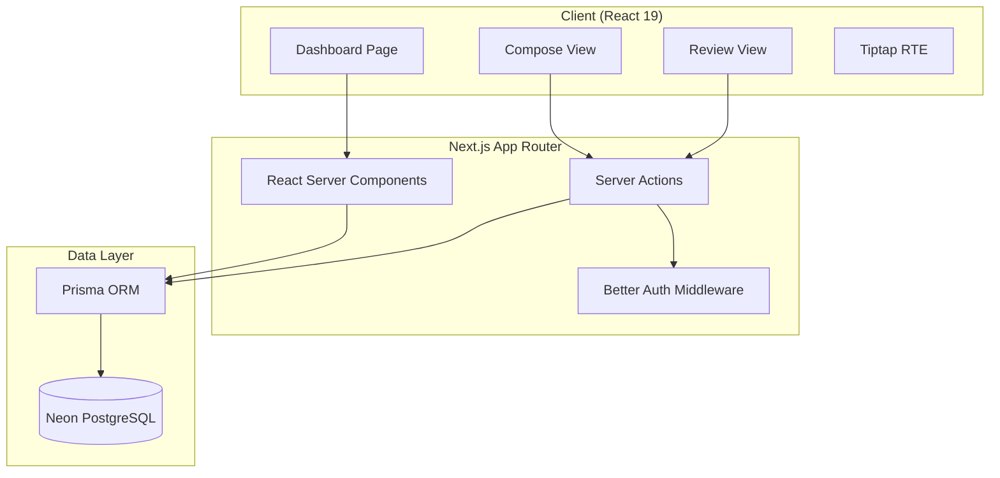
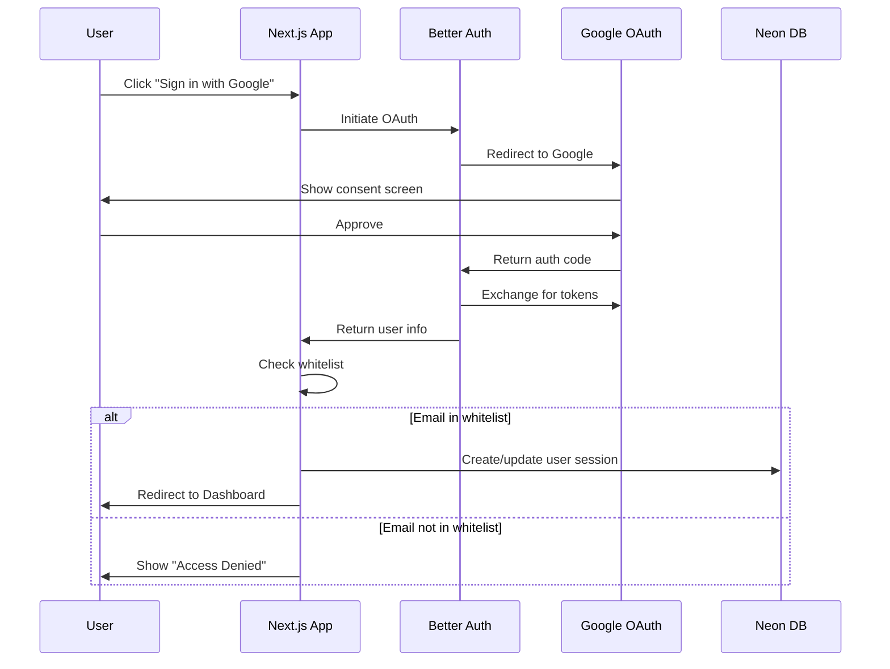
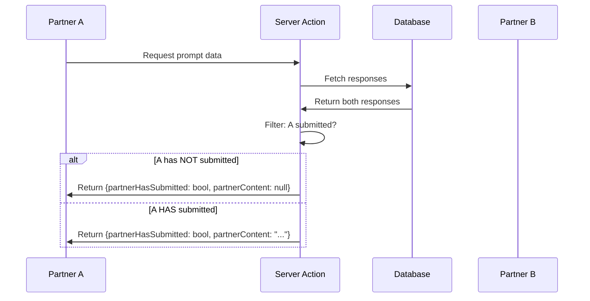
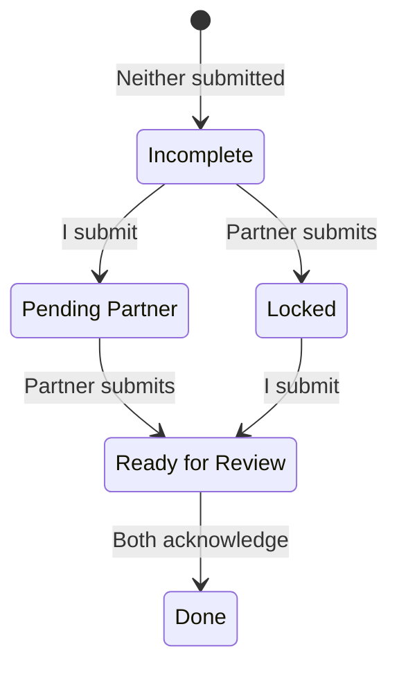

# Design Document: Double-Blind Relationship Audit

## Overview

This design document outlines the technical architecture for a Double-Blind Relationship Audit application. The system enables two partners to independently answer relationship prompts without seeing each other's responses until both have submitted. The architecture follows React 19 patterns with compound components, server-side privacy enforcement, and optimistic UI updates.

### Key Design Principles

1. **Privacy by Design**: Server-side enforcement of the double-blind protocol at the data layer
2. **Compound Components**: Flexible, composable UI components following Vercel patterns
3. **Optimistic Updates**: Responsive UI with TanStack Query mutation handlers
4. **Type Safety**: End-to-end TypeScript with Zod validation schemas
5. **Performance**: Dynamic imports, Suspense boundaries, and efficient data fetching

## Architecture

### High-Level Architecture



### Authentication Flow



### Double-Blind Data Flow



## Components and Interfaces

### Directory Structure

```
src/
├── app/
│   ├── (auth)/
│   │   ├── login/page.tsx
│   │   └── layout.tsx
│   ├── (dashboard)/
│   │   ├── page.tsx
│   │   ├── prompt/[id]/
│   │   │   ├── page.tsx
│   │   │   └── review/page.tsx
│   │   └── layout.tsx
│   ├── api/auth/[...all]/route.ts
│   └── layout.tsx
├── components/
│   ├── ui/                    # Shadcn UI components
│   ├── dashboard/
│   │   ├── prompt-list.tsx
│   │   ├── prompt-card.tsx
│   │   └── status-badge.tsx
│   ├── composer/
│   │   ├── index.tsx          # Compound component exports
│   │   ├── composer-provider.tsx
│   │   ├── composer-frame.tsx
│   │   ├── composer-editor.tsx
│   │   ├── composer-toolbar.tsx
│   │   └── composer-actions.tsx
│   └── review/
│       ├── index.tsx          # Compound component exports
│       ├── review-provider.tsx
│       ├── review-split.tsx
│       ├── response-panel.tsx
│       └── acknowledge-button.tsx
├── lib/
│   ├── auth.ts                # Better Auth config
│   ├── db.ts                  # Prisma client
│   ├── queries.ts             # TanStack Query hooks
│   └── actions/
│       ├── response.ts        # Response server actions
│       └── acknowledgment.ts  # Acknowledgment server actions
├── schemas/
│   └── response.ts            # Zod validation schemas
└── types/
    └── index.ts               # TypeScript types
```

### Compound Component: Composer

Following Vercel composition patterns, the Composer uses a provider for state management with composable sub-components.

```typescript
// Context Interface (state, actions, meta pattern)
interface ComposerState {
  content: string
  isDirty: boolean
  isSaving: boolean
  isSubmitting: boolean
  isSubmitted: boolean
}

interface ComposerActions {
  updateContent: (content: string) => void
  saveDraft: () => Promise<void>
  submit: () => Promise<void>
}

interface ComposerMeta {
  promptId: string
  promptText: string
  editorRef: React.RefObject<Editor>
}

interface ComposerContextValue {
  state: ComposerState
  actions: ComposerActions
  meta: ComposerMeta
}

// Compound Component Structure
const Composer = {
  Provider: ComposerProvider,    // State management
  Frame: ComposerFrame,          // Layout wrapper
  Prompt: ComposerPrompt,        // Question display
  Editor: ComposerEditor,        // Tiptap RTE
  Toolbar: ComposerToolbar,      // Formatting buttons
  Actions: ComposerActions,      // Save/Submit buttons
}

// Usage Example
<Composer.Provider promptId={id} initialContent={draft}>
  <Composer.Frame>
    <Composer.Prompt />
    <Composer.Toolbar />
    <Composer.Editor />
    <Composer.Actions />
  </Composer.Frame>
</Composer.Provider>
```

### Compound Component: Review

```typescript
// Context Interface
interface ReviewState {
  myResponse: Response
  partnerResponse: Response
  myAcknowledgment: Acknowledgment | null
  partnerAcknowledgment: Acknowledgment | null
}

interface ReviewActions {
  acknowledge: () => Promise<void>
}

interface ReviewMeta {
  promptId: string
  promptText: string
}

interface ReviewContextValue {
  state: ReviewState
  actions: ReviewActions
  meta: ReviewMeta
}

// Compound Component Structure
const Review = {
  Provider: ReviewProvider,
  Split: ReviewSplit,           // Side-by-side layout
  MyResponse: MyResponsePanel,
  PartnerResponse: PartnerResponsePanel,
  AcknowledgeButton: AcknowledgeButton,
  Status: ReviewStatus,
}

// Usage Example
<Review.Provider promptId={id} responses={responses}>
  <Review.Split>
    <Review.MyResponse />
    <Review.PartnerResponse>
      <Review.AcknowledgeButton />
    </Review.PartnerResponse>
  </Review.Split>
  <Review.Status />
</Review.Provider>
```

### Server Actions with Authentication

Following Vercel security guidelines, each server action authenticates inside the function:

```typescript
// lib/actions/response.ts
'use server'

import { auth } from '@/lib/auth'
import { db } from '@/lib/db'
import { responseSchema } from '@/schemas/response'
import { revalidatePath } from 'next/cache'

export async function saveDraft(data: unknown) {
  // 1. Authenticate inside the action
  const session = await auth()
  if (!session?.user) {
    throw new Error('Unauthorized')
  }
  
  // 2. Validate input
  const validated = responseSchema.parse(data)
  
  // 3. Authorize (user can only save their own response)
  const existing = await db.response.findUnique({
    where: { promptId_userId: { promptId: validated.promptId, userId: session.user.id } }
  })
  if (existing?.isSubmitted) {
    throw new Error('Cannot modify submitted response')
  }
  
  // 4. Perform mutation
  const response = await db.response.upsert({
    where: { promptId_userId: { promptId: validated.promptId, userId: session.user.id } },
    create: {
      promptId: validated.promptId,
      userId: session.user.id,
      content: validated.content,
      isSubmitted: false,
    },
    update: {
      content: validated.content,
      updatedAt: new Date(),
    },
  })
  
  revalidatePath(`/prompt/${validated.promptId}`)
  return response
}

export async function submitResponse(data: unknown) {
  const session = await auth()
  if (!session?.user) {
    throw new Error('Unauthorized')
  }
  
  const validated = responseSchema.parse(data)
  
  // Check not already submitted
  const existing = await db.response.findUnique({
    where: { promptId_userId: { promptId: validated.promptId, userId: session.user.id } }
  })
  if (existing?.isSubmitted) {
    throw new Error('Already submitted')
  }
  
  const response = await db.response.upsert({
    where: { promptId_userId: { promptId: validated.promptId, userId: session.user.id } },
    create: {
      promptId: validated.promptId,
      userId: session.user.id,
      content: validated.content,
      isSubmitted: true,
      submittedAt: new Date(),
    },
    update: {
      content: validated.content,
      isSubmitted: true,
      submittedAt: new Date(),
    },
  })
  
  revalidatePath(`/prompt/${validated.promptId}`)
  return response
}
```

### Privacy-Enforcing Data Fetcher

```typescript
// lib/queries.ts
import { cache } from 'react'
import { auth } from '@/lib/auth'
import { db } from '@/lib/db'

export const getPromptWithResponses = cache(async (promptId: string) => {
  const session = await auth()
  if (!session?.user) {
    throw new Error('Unauthorized')
  }
  
  const prompt = await db.prompt.findUnique({
    where: { id: promptId },
    include: {
      responses: {
        include: {
          acknowledgments: true,
        },
      },
    },
  })
  
  if (!prompt) {
    throw new Error('Prompt not found')
  }
  
  const myResponse = prompt.responses.find(r => r.userId === session.user.id)
  const partnerResponse = prompt.responses.find(r => r.userId !== session.user.id)
  
  // PRIVACY ENFORCEMENT: Only return partner content if I have submitted
  return {
    prompt: {
      id: prompt.id,
      text: prompt.text,
      order: prompt.order,
    },
    myResponse: myResponse ?? null,
    partnerResponse: partnerResponse ? {
      id: partnerResponse.id,
      isSubmitted: partnerResponse.isSubmitted,
      submittedAt: partnerResponse.submittedAt,
      // CRITICAL: Only include content if current user has submitted
      content: myResponse?.isSubmitted ? partnerResponse.content : null,
      acknowledgments: partnerResponse.acknowledgments,
    } : null,
  }
})
```

### TanStack Query Hooks with Optimistic Updates

```typescript
// lib/queries.ts (client-side)
'use client'

import { useMutation, useQueryClient } from '@tanstack/react-query'
import { saveDraft, submitResponse } from '@/lib/actions/response'
import { acknowledgeResponse } from '@/lib/actions/acknowledgment'

export function useSaveDraft(promptId: string) {
  const queryClient = useQueryClient()
  
  return useMutation({
    mutationFn: saveDraft,
    onMutate: async (newData) => {
      // Cancel outgoing refetches
      await queryClient.cancelQueries({ queryKey: ['prompt', promptId] })
      
      // Snapshot previous value
      const previous = queryClient.getQueryData(['prompt', promptId])
      
      // Optimistically update
      queryClient.setQueryData(['prompt', promptId], (old: any) => ({
        ...old,
        myResponse: {
          ...old?.myResponse,
          content: newData.content,
        },
      }))
      
      return { previous }
    },
    onError: (err, newData, context) => {
      // Rollback on error
      queryClient.setQueryData(['prompt', promptId], context?.previous)
    },
    onSettled: () => {
      // Refetch after mutation
      queryClient.invalidateQueries({ queryKey: ['prompt', promptId] })
    },
  })
}

export function useSubmitResponse(promptId: string) {
  const queryClient = useQueryClient()
  
  return useMutation({
    mutationFn: submitResponse,
    onMutate: async (newData) => {
      await queryClient.cancelQueries({ queryKey: ['prompt', promptId] })
      const previous = queryClient.getQueryData(['prompt', promptId])
      
      queryClient.setQueryData(['prompt', promptId], (old: any) => ({
        ...old,
        myResponse: {
          ...old?.myResponse,
          content: newData.content,
          isSubmitted: true,
          submittedAt: new Date().toISOString(),
        },
      }))
      
      return { previous }
    },
    onError: (err, newData, context) => {
      queryClient.setQueryData(['prompt', promptId], context?.previous)
    },
    onSettled: () => {
      queryClient.invalidateQueries({ queryKey: ['prompt', promptId] })
      queryClient.invalidateQueries({ queryKey: ['prompts'] })
    },
  })
}

export function useAcknowledge(promptId: string) {
  const queryClient = useQueryClient()
  
  return useMutation({
    mutationFn: acknowledgeResponse,
    onMutate: async (data) => {
      await queryClient.cancelQueries({ queryKey: ['prompt', promptId] })
      const previous = queryClient.getQueryData(['prompt', promptId])
      
      queryClient.setQueryData(['prompt', promptId], (old: any) => ({
        ...old,
        partnerResponse: {
          ...old?.partnerResponse,
          acknowledgments: [
            ...(old?.partnerResponse?.acknowledgments ?? []),
            { acknowledgedAt: new Date().toISOString() },
          ],
        },
      }))
      
      return { previous }
    },
    onError: (err, data, context) => {
      queryClient.setQueryData(['prompt', promptId], context?.previous)
    },
    onSettled: () => {
      queryClient.invalidateQueries({ queryKey: ['prompt', promptId] })
      queryClient.invalidateQueries({ queryKey: ['prompts'] })
    },
  })
}
```


## Data Models

### Prisma Schema

```prisma
// prisma/schema.prisma

generator client {
  provider = "prisma-client-js"
}

datasource db {
  provider = "postgresql"
  url      = env("DATABASE_URL")
}

model User {
  id            String    @id @default(cuid())
  email         String    @unique
  name          String?
  image         String?
  createdAt     DateTime  @default(now())
  updatedAt     DateTime  @updatedAt
  
  responses     Response[]
  acknowledgments Acknowledgment[]
  sessions      Session[]
  accounts      Account[]
}

model Account {
  id                String  @id @default(cuid())
  userId            String
  type              String
  provider          String
  providerAccountId String
  refresh_token     String? @db.Text
  access_token      String? @db.Text
  expires_at        Int?
  token_type        String?
  scope             String?
  id_token          String? @db.Text
  session_state     String?
  
  user User @relation(fields: [userId], references: [id], onDelete: Cascade)
  
  @@unique([provider, providerAccountId])
}

model Session {
  id           String   @id @default(cuid())
  sessionToken String   @unique
  userId       String
  expires      DateTime
  
  user User @relation(fields: [userId], references: [id], onDelete: Cascade)
}

model Prompt {
  id        String   @id @default(cuid())
  text      String   @db.Text
  order     Int      @default(0)
  createdAt DateTime @default(now())
  updatedAt DateTime @updatedAt
  
  responses Response[]
  
  @@index([order])
}

model Response {
  id          String    @id @default(cuid())
  promptId    String
  userId      String
  content     String    @db.Text  // HTML from Tiptap
  isSubmitted Boolean   @default(false)
  submittedAt DateTime?
  createdAt   DateTime  @default(now())
  updatedAt   DateTime  @updatedAt
  
  prompt      Prompt    @relation(fields: [promptId], references: [id], onDelete: Cascade)
  user        User      @relation(fields: [userId], references: [id], onDelete: Cascade)
  acknowledgments Acknowledgment[]
  
  @@unique([promptId, userId])
  @@index([promptId])
  @@index([userId])
}

model Acknowledgment {
  id            String   @id @default(cuid())
  responseId    String
  userId        String   // User who acknowledged (reader, not author)
  acknowledgedAt DateTime @default(now())
  
  response Response @relation(fields: [responseId], references: [id], onDelete: Cascade)
  user     User     @relation(fields: [userId], references: [id], onDelete: Cascade)
  
  @@unique([responseId, userId])
  @@index([responseId])
  @@index([userId])
}
```

### Zod Validation Schemas

```typescript
// schemas/response.ts
import { z } from 'zod'

export const responseSchema = z.object({
  promptId: z.string().cuid(),
  content: z.string().min(1, 'Response cannot be empty').max(50000, 'Response too long'),
})

export const acknowledgmentSchema = z.object({
  responseId: z.string().cuid(),
})

export type ResponseInput = z.infer<typeof responseSchema>
export type AcknowledgmentInput = z.infer<typeof acknowledgmentSchema>
```

### TypeScript Types

```typescript
// types/index.ts

export type PromptStatus = 
  | 'incomplete'      // User has not submitted
  | 'pending_partner' // User submitted, partner has not
  | 'locked'          // Partner submitted, user has not
  | 'ready_for_review'// Both submitted, acknowledgments incomplete
  | 'done'            // Both submitted and acknowledged

export interface PromptWithStatus {
  id: string
  text: string
  order: number
  status: PromptStatus
  myResponse: {
    id: string
    content: string
    isSubmitted: boolean
    submittedAt: string | null
  } | null
  partnerResponse: {
    id: string
    isSubmitted: boolean
    submittedAt: string | null
    content: string | null  // null if privacy-filtered
    hasMyAcknowledgment: boolean
    hasPartnerAcknowledgment: boolean
  } | null
}

export function computePromptStatus(
  myResponse: { isSubmitted: boolean } | null,
  partnerResponse: { isSubmitted: boolean; hasMyAcknowledgment: boolean; hasPartnerAcknowledgment: boolean } | null
): PromptStatus {
  const mySubmitted = myResponse?.isSubmitted ?? false
  const partnerSubmitted = partnerResponse?.isSubmitted ?? false
  
  if (!mySubmitted && !partnerSubmitted) return 'incomplete'
  if (mySubmitted && !partnerSubmitted) return 'pending_partner'
  if (!mySubmitted && partnerSubmitted) return 'locked'
  
  // Both submitted
  const bothAcknowledged = 
    (partnerResponse?.hasMyAcknowledgment ?? false) && 
    (partnerResponse?.hasPartnerAcknowledgment ?? false)
  
  return bothAcknowledged ? 'done' : 'ready_for_review'
}
```

### Status Computation Logic




## Correctness Properties

*A property is a characteristic or behavior that should hold true across all valid executions of a system—essentially, a formal statement about what the system should do. Properties serve as the bridge between human-readable specifications and machine-verifiable correctness guarantees.*

### Property 1: Whitelist Authentication Enforcement

*For any* email address attempting authentication, the system SHALL grant access if and only if the email is in the configured whitelist of exactly two permitted addresses.

**Validates: Requirements 1.2, 1.3**

### Property 2: Prompt Status Computation

*For any* combination of response submission states (mySubmitted, partnerSubmitted) and acknowledgment states (myAcknowledged, partnerAcknowledged), the `computePromptStatus` function SHALL return the correct status according to the state machine:
- Neither submitted → "incomplete"
- Only I submitted → "pending_partner"
- Only partner submitted → "locked"
- Both submitted, not both acknowledged → "ready_for_review"
- Both submitted and both acknowledged → "done"

**Validates: Requirements 2.2, 2.3, 2.4, 2.5, 2.6, 7.4, 7.5**

### Property 3: Response State Transitions

*For any* response mutation:
- Saving as draft SHALL result in `isSubmitted = false` and `submittedAt = null`
- Submitting SHALL result in `isSubmitted = true` and `submittedAt` being a valid timestamp

**Validates: Requirements 3.6, 3.8, 8.2**

### Property 4: Content Round-Trip Preservation

*For any* valid HTML content string, saving the content to the database and then loading it back SHALL return content that is equivalent to the original (preserving all formatting).

**Validates: Requirements 3.7, 8.3**

### Property 5: Submitted Response Immutability

*For any* response where `isSubmitted = true`, all subsequent edit or save attempts SHALL be rejected with an error, leaving the response unchanged.

**Validates: Requirements 3.9**

### Property 6: Double-Blind Privacy Enforcement

*For any* request to fetch prompt data:
- IF the requesting user's response `isSubmitted = false`, THEN `partnerResponse.content` SHALL be `null`
- IF the requesting user's response `isSubmitted = true`, THEN `partnerResponse.content` SHALL contain the actual content (if partner has submitted)

This property ensures the double-blind protocol is enforced at the data layer.

**Validates: Requirements 4.1, 4.2, 4.3, 4.5**

### Property 7: Acknowledgment Recording

*For any* acknowledgment action on a partner's response, the system SHALL create an acknowledgment record with a valid `acknowledgedAt` timestamp.

**Validates: Requirements 7.2**

### Property 8: Acknowledgment Idempotency

*For any* response, if a user acknowledges it multiple times, the system SHALL maintain exactly one acknowledgment record for that user-response pair (no duplicates).

**Validates: Requirements 7.3**

### Property 9: Server Action Authentication

*For any* server action (saveDraft, submitResponse, acknowledgeResponse) invoked without a valid authenticated session, the action SHALL throw an "Unauthorized" error and perform no database mutations.

**Validates: Requirements 8.6**

### Property 10: Empty Response Validation

*For any* response content that is empty or consists only of whitespace characters, submission SHALL be rejected with a validation error.

**Validates: Requirements 9.1**

## Error Handling

### Authentication Errors

| Error Condition | User Message | System Action |
|----------------|--------------|---------------|
| Email not in whitelist | "Access denied. This app is restricted to authorized users only." | Log attempt, redirect to login |
| OAuth failure | "Authentication failed. Please try again." | Log error, show retry option |
| Session expired | "Your session has expired. Please sign in again." | Clear session, redirect to login |

### Data Operation Errors

| Error Condition | User Message | System Action |
|----------------|--------------|---------------|
| Save draft fails | "Failed to save draft. Your changes are preserved locally." | Keep local state, show retry |
| Submit fails | "Failed to submit response. Please try again." | Rollback optimistic update, show retry |
| Acknowledge fails | "Failed to record acknowledgment. Please try again." | Rollback optimistic update, show retry |
| Load prompt fails | "Failed to load prompt. Please refresh the page." | Show error state with refresh button |

### Validation Errors

| Error Condition | User Message | System Action |
|----------------|--------------|---------------|
| Empty response | "Please enter a response before submitting." | Highlight editor, prevent submit |
| Response too long | "Response exceeds maximum length (50,000 characters)." | Show character count, prevent submit |
| Invalid prompt ID | "Prompt not found." | Redirect to dashboard |

### Optimistic Update Rollback

When an optimistic update fails:
1. Revert UI to previous state using TanStack Query's `context.previous`
2. Display toast notification with error message
3. Log error for debugging
4. Preserve user's input in local state for retry

```typescript
// Error handling in mutation
onError: (error, variables, context) => {
  // Rollback optimistic update
  queryClient.setQueryData(['prompt', promptId], context?.previous)
  
  // Show user-friendly error
  toast.error(getErrorMessage(error))
  
  // Log for debugging
  console.error('Mutation failed:', error)
}
```

## Testing Strategy

### Dual Testing Approach

This application requires both unit tests and property-based tests for comprehensive coverage:

- **Unit tests**: Verify specific examples, edge cases, UI interactions, and integration points
- **Property tests**: Verify universal properties across all valid inputs using randomized testing

### Property-Based Testing Configuration

**Library**: [fast-check](https://github.com/dubzzz/fast-check) for TypeScript property-based testing

**Configuration**:
- Minimum 100 iterations per property test
- Each test tagged with feature and property reference
- Tag format: `Feature: double-blind-relationship-audit, Property N: [property description]`

### Test Categories

#### 1. Property-Based Tests (Core Logic)

| Property | Test Description | Generator Strategy |
|----------|------------------|-------------------|
| Property 1 | Whitelist enforcement | Generate random email strings |
| Property 2 | Status computation | Generate all combinations of boolean states |
| Property 3 | Response state transitions | Generate random content + action type |
| Property 4 | Content round-trip | Generate random HTML strings with Tiptap-valid formatting |
| Property 5 | Submitted immutability | Generate submitted responses + edit attempts |
| Property 6 | Privacy enforcement | Generate response states + requester submission status |
| Property 7 | Acknowledgment recording | Generate valid acknowledgment requests |
| Property 8 | Acknowledgment idempotency | Generate multiple acknowledgment attempts |
| Property 9 | Server action auth | Generate requests with/without valid sessions |
| Property 10 | Empty validation | Generate whitespace-only strings |

#### 2. Unit Tests (Specific Examples)

- Authentication flow happy path
- Dashboard rendering with various prompt states
- RTE formatting (bold, italic, bullets)
- Navigation between views
- Error message display
- Optimistic update behavior

#### 3. Integration Tests

- Full save draft → load draft flow
- Full submit → review → acknowledge flow
- OAuth callback handling
- Database constraint enforcement

### Test File Structure

```
__tests__/
├── properties/
│   ├── whitelist.property.test.ts
│   ├── status-computation.property.test.ts
│   ├── response-state.property.test.ts
│   ├── content-roundtrip.property.test.ts
│   ├── immutability.property.test.ts
│   ├── privacy.property.test.ts
│   ├── acknowledgment.property.test.ts
│   ├── auth.property.test.ts
│   └── validation.property.test.ts
├── unit/
│   ├── components/
│   │   ├── dashboard.test.tsx
│   │   ├── composer.test.tsx
│   │   └── review.test.tsx
│   ├── hooks/
│   │   └── queries.test.ts
│   └── utils/
│       └── status.test.ts
└── integration/
    ├── auth-flow.test.ts
    ├── response-flow.test.ts
    └── review-flow.test.ts
```

### Example Property Test

```typescript
// __tests__/properties/privacy.property.test.ts
import fc from 'fast-check'
import { filterResponseForPrivacy } from '@/lib/queries'

describe('Feature: double-blind-relationship-audit, Property 6: Privacy enforcement', () => {
  it('should hide partner content when requester has not submitted', () => {
    fc.assert(
      fc.property(
        fc.record({
          partnerContent: fc.string({ minLength: 1 }),
          partnerSubmitted: fc.boolean(),
          requesterSubmitted: fc.constant(false), // Key: requester NOT submitted
        }),
        ({ partnerContent, partnerSubmitted, requesterSubmitted }) => {
          const result = filterResponseForPrivacy({
            partnerResponse: {
              content: partnerContent,
              isSubmitted: partnerSubmitted,
            },
            requesterSubmitted,
          })
          
          // Partner content must be null when requester hasn't submitted
          expect(result.partnerResponse?.content).toBeNull()
        }
      ),
      { numRuns: 100 }
    )
  })

  it('should reveal partner content when requester has submitted', () => {
    fc.assert(
      fc.property(
        fc.record({
          partnerContent: fc.string({ minLength: 1 }),
          requesterSubmitted: fc.constant(true), // Key: requester HAS submitted
        }),
        ({ partnerContent, requesterSubmitted }) => {
          const result = filterResponseForPrivacy({
            partnerResponse: {
              content: partnerContent,
              isSubmitted: true,
            },
            requesterSubmitted,
          })
          
          // Partner content should be visible
          expect(result.partnerResponse?.content).toBe(partnerContent)
        }
      ),
      { numRuns: 100 }
    )
  })
})
```

### Example Unit Test

```typescript
// __tests__/unit/utils/status.test.ts
import { computePromptStatus } from '@/types'

describe('computePromptStatus', () => {
  it('returns "incomplete" when neither has submitted', () => {
    expect(computePromptStatus(null, null)).toBe('incomplete')
    expect(computePromptStatus({ isSubmitted: false }, null)).toBe('incomplete')
  })

  it('returns "pending_partner" when only I submitted', () => {
    expect(computePromptStatus(
      { isSubmitted: true },
      { isSubmitted: false, hasMyAcknowledgment: false, hasPartnerAcknowledgment: false }
    )).toBe('pending_partner')
  })

  it('returns "locked" when only partner submitted', () => {
    expect(computePromptStatus(
      { isSubmitted: false },
      { isSubmitted: true, hasMyAcknowledgment: false, hasPartnerAcknowledgment: false }
    )).toBe('locked')
  })

  it('returns "ready_for_review" when both submitted but not acknowledged', () => {
    expect(computePromptStatus(
      { isSubmitted: true },
      { isSubmitted: true, hasMyAcknowledgment: false, hasPartnerAcknowledgment: false }
    )).toBe('ready_for_review')
  })

  it('returns "done" when both submitted and acknowledged', () => {
    expect(computePromptStatus(
      { isSubmitted: true },
      { isSubmitted: true, hasMyAcknowledgment: true, hasPartnerAcknowledgment: true }
    )).toBe('done')
  })
})
```
