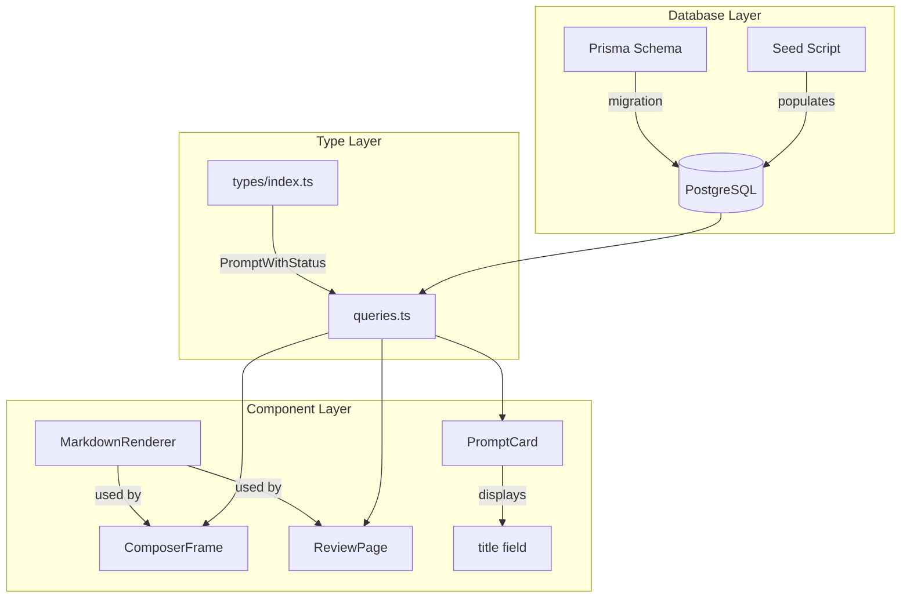

# Design Document: Prompt Title and Markdown Rendering

## Overview

This design describes the implementation of two related enhancements to the prompt system:

1. **Title Field Addition**: Adding a `title` field to the Prisma Prompt model to provide meaningful headers for prompts instead of generic "Prompt {order}" labels.

2. **Markdown Rendering**: Implementing markdown rendering for prompt text using the `react-markdown` library to display formatted content with headings, lists, emphasis, and other markdown elements.

The changes span the database layer (Prisma schema), type definitions, seed data, and multiple UI components that display prompt information.

## Architecture



### Component Responsibilities

| Component | Responsibility |
|-----------|---------------|
| Prisma Schema | Define `title` field on Prompt model |
| Seed Script | Provide titles for all relationship prompts |
| PromptWithStatus | Include title in TypeScript interface |
| MarkdownRenderer | Reusable component for rendering markdown |
| PromptCard | Display title as primary header |
| ComposerFrame | Render prompt text as markdown |
| ReviewPage | Render prompt text as markdown in header |

## Components and Interfaces

### Database Schema Change

The Prompt model will be extended with a required `title` field:

```prisma
model Prompt {
  id        String   @id @default(cuid())
  title     String   // NEW: Required title field
  text      String   @db.Text
  order     Int      @default(0)
  createdAt DateTime @default(now())
  updatedAt DateTime @updatedAt

  responses Response[]

  @@index([order])
}
```

### MarkdownRenderer Component

A new reusable component for rendering markdown content:

```typescript
interface MarkdownRendererProps {
  content: string
  className?: string
}

function MarkdownRenderer({ content, className }: MarkdownRendererProps): JSX.Element
```

The component will:
- Use `react-markdown` for parsing and rendering
- Apply Tailwind prose classes for consistent styling
- Support dark mode through `dark:prose-invert`
- Handle empty or plain text content gracefully

### Updated PromptWithStatus Interface

```typescript
interface PromptWithStatus {
  id: string
  title: string  // NEW
  text: string
  order: number
  status: PromptStatus
  myResponse: { ... } | null
  partnerResponse: { ... } | null
}
```

### Component Updates

**PromptCard Changes:**
- Display `prompt.title` as the card header
- Keep "Prompt {order}" as a secondary label above the title
- Truncate long titles with `line-clamp-2`

**ComposerFrame Changes:**
- Replace direct text display with MarkdownRenderer
- Pass `meta.promptText` to MarkdownRenderer

**ReviewPage Changes:**
- Replace `<h1>{promptText}</h1>` with MarkdownRenderer
- Apply appropriate heading styles

## Data Models

### Prompt Model (Updated)

| Field | Type | Constraints | Description |
|-------|------|-------------|-------------|
| id | String | Primary Key, CUID | Unique identifier |
| title | String | Required | Short descriptive title for the prompt |
| text | String | Text, Required | Full prompt content (may contain markdown) |
| order | Int | Default 0, Indexed | Display order |
| createdAt | DateTime | Default now() | Creation timestamp |
| updatedAt | DateTime | Auto-updated | Last modification timestamp |

### Seed Data Titles

Each prompt will receive a descriptive title:

| Order | Title |
|-------|-------|
| 1 | Daily Logistics & Priorities |
| 2 | Theology vs. Psychology |
| 3 | The Reality of Home Education |
| 4 | Decision Making & Conflict Resolution |
| 5 | Financial Stewardship & Standard of Living |
| 6 | Philosophy of Discipline |
| 7 | Medical Philosophy & Biological Trust |
| 8 | Technology, Privacy, and Data |
| 9 | Extended Family Influence |
| 10 | Cultural Engagement vs. Isolation |


## Correctness Properties

*A property is a characteristic or behavior that should hold true across all valid executions of a system—essentially, a formal statement about what the system should do. Properties serve as the bridge between human-readable specifications and machine-verifiable correctness guarantees.*

### Property 1: Seeded Prompts Have Non-Empty Titles

*For any* prompt created by the seed script, the title field SHALL be a non-empty string.

**Validates: Requirements 1.3**

### Property 2: PromptCard Renders Title and Order

*For any* PromptWithStatus object passed to PromptCard, the rendered output SHALL contain both the prompt's title and a label matching "Prompt {order}".

**Validates: Requirements 3.1, 3.2**

### Property 3: Markdown Rendering Produces Valid Output

*For any* valid markdown string input, the MarkdownRenderer SHALL produce a non-empty HTML output that preserves the semantic content of the input.

**Validates: Requirements 4.1, 4.2**

### Property 4: XSS Sanitization

*For any* input string containing potentially malicious HTML or script tags, the MarkdownRenderer SHALL produce output that does not contain executable script elements or dangerous HTML attributes.

**Validates: Requirements 5.2**

## Error Handling

| Scenario | Handling Strategy |
|----------|-------------------|
| Empty markdown input | Render empty container, no error |
| Invalid markdown syntax | react-markdown handles gracefully, renders as text |
| Missing title in database | Prisma enforces required field at schema level |
| XSS attempt in markdown | react-markdown sanitizes by default, no raw HTML allowed |
| Long titles | CSS truncation with `line-clamp-2` |

## Testing Strategy

### Unit Tests

Unit tests will verify specific examples and edge cases:

1. **MarkdownRenderer Examples**
   - Renders heading markdown (`# Title`) to `<h1>` element
   - Renders bold markdown (`**text**`) to `<strong>` element
   - Renders list markdown to `<ul>/<li>` elements
   - Renders plain text without modification

2. **PromptCard Examples**
   - Displays provided title text
   - Displays "Prompt {order}" label with correct order number

3. **Edge Cases**
   - Empty string input to MarkdownRenderer
   - Very long title truncation
   - Prompt with no markdown in text

### Property-Based Tests

Property-based tests will use a testing library (e.g., fast-check) to verify universal properties:

1. **Property 1**: Generate random non-empty strings, verify seed data structure
2. **Property 2**: Generate random PromptWithStatus objects, verify PromptCard output
3. **Property 3**: Generate random valid markdown strings, verify HTML output
4. **Property 4**: Generate strings with script tags and event handlers, verify sanitization

Each property test should run minimum 100 iterations.

**Tag format**: Feature: prompt-title-markdown, Property {number}: {property_text}
